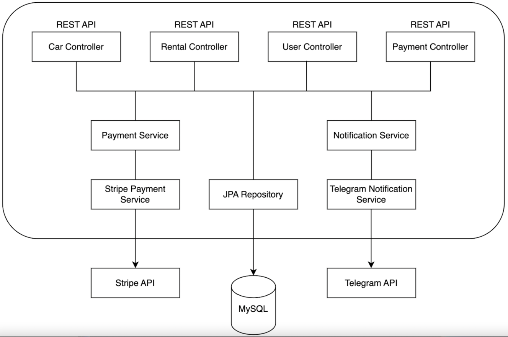
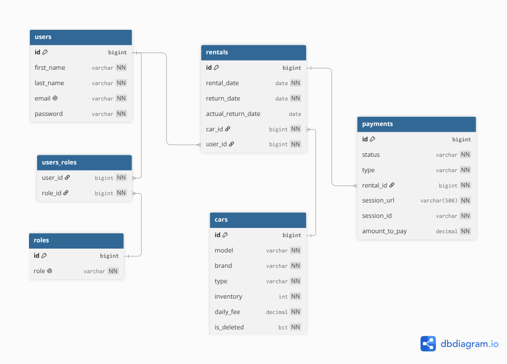
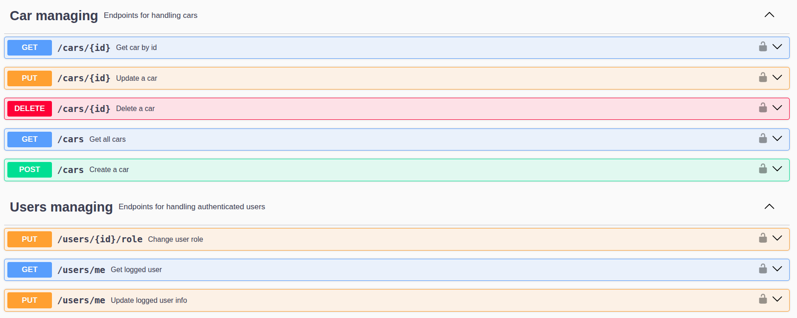
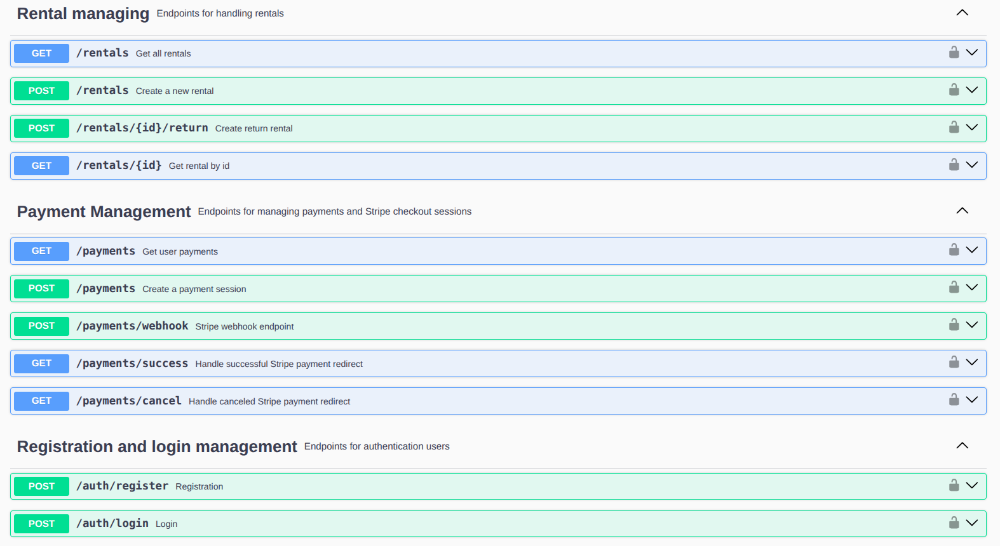

# Car Sharing Service API


A RESTful backend platform for managing an automated car sharing service.  
The system supports user management, car inventory tracking, rental processing, Stripe payments, and Telegram notifications.  
Built using clean architecture, SOLID principles, and modern Java backend practices.

---

## Overview

The **Car Sharing Service API** enables customers to browse available cars, rent vehicles, pay rental fees or fines, and manage their rental history.  
Managers can administer inventory, user roles, and global rental/payment statistics.

### System Capacity
- **Concurrency:** up to 5 active sessions
- **Inventory:** up to 1,000 vehicles
- **Throughput:** ~50,000 rentals/year (~30MB/year)

---

## Features

### Authentication & Authorization
- JWT-based login & registration
- Role-based access (`MANAGER`, `CUSTOMER`)
- Customer profile management

### Car Inventory
- Full CRUD for cars
- Public browsing of available vehicles
- Automatic inventory updates on rental/return

### Rental Management
- Rental creation with inventory reduction
- Blocking rentals if unpaid fees exist
- Return processing with actual return date
- Filtering by user and active status
- Daily overdue rental checks

### Payments (Stripe)
- Stripe Checkout Sessions for payments & fines
- Fine formula: `moneyToPay = overdueDays × dailyFee × fineMultiplier`
- Success/cancel callbacks
- Tracking expired sessions

### Notifications (Telegram)
- Real-time admin alerts
- Daily overdue reports
- Payment confirmation notifications

---

## Architecture



### Layers
- **Controllers** — HTTP endpoints, validation, DTO mapping
- **Services** — business logic, fine calculations, scheduling
- **Integrations** — Stripe API, Telegram Bot API
- **Repositories** — JPA + Liquibase migrations

---

## Technologies

| Category            | Technology                        |
| ------------------- | --------------------------------- |
| Language            | Java 21                           |
| Framework           | Spring Boot 4.x                   |
| Security            | Spring Security, JWT              |
| Database            | MySQL 8, H2 (tests)               |
| ORM                 | Spring Data JPA, Hibernate        |
| Migrations          | Liquibase                         |
| External APIs       | Stripe SDK, Telegram Bot API      |
| Mapping             | MapStruct                         |
| Validation          | Jakarta Validation                |
| Testing             | JUnit 5, Testcontainers           |
| Build Tool          | Maven                             |
| Containerization    | Docker, Docker Compose            |
| Documentation       | Springdoc OpenAPI                 |

---

## Database Model



### Entities
- **User** — id, email, firstName, lastName, password, role
- **Car** — id, model, brand, type, inventory, dailyFee
- **Rental** — id, rentalDate, returnDate, actualReturnDate, carId, userId
- **Payment** — id, status, type, rentalId, sessionUrl, sessionId, amountToPay

### Relationships
- User → Rentals
- Car → Rentals
- Rental → Payments

---

## Getting Started

### Prerequisites
- Java 21
- Maven 3.8+
- Docker & Docker Compose

### Local Run (without Docker)

Configure MySQL in `application.properties`:

```properties
spring.datasource.url=jdbc:mysql://localhost:3306/car_sharing
spring.datasource.username=your_mysql_user
spring.datasource.password=your_mysql_password
```

Build & run:

```bash
mvn clean install
mvn spring-boot:run
```

App starts at:  
http://localhost:8080

---

## Running with Docker

### Environment Variables

Copy template:

```bash
cp .env.sample .env
```

Fill in:

```
MYSQLDB_USER=
MYSQLDB_PASSWORD=
MYSQLDB_ROOT_PASSWORD=
MYSQLDB_DATABASE=
MYSQLDB_LOCAL_PORT=
MYSQLDB_DOCKER_PORT=
SPRING_LOCAL_PORT=
SPRING_DOCKER_PORT=
DEBUG_PORT=
TELEGRAM_TOKEN=
TELEGRAM_CHAT_ID=
STRIPE.WEBHOOK.SECRET=
STRIPE.SECRET-KEY=
STRIPE.PUBLISHABLE-KEY=
```

### Start with Docker Compose

```bash
docker compose up --build -d
```

App available at:  
`http://localhost:${SPRING_LOCAL_PORT}`

---

## API Documentation (Swagger)

### Test Accounts
**Manager:**
```
email: manager@gmail.com
password: 12345678
```

**Customer:**
```
email: customer@gmail.com
password: 12345678
```

Swagger UI:  
http://localhost:8080/swagger-ui/index.html




---

## API Endpoints

### Authentication
| Method | Endpoint | Access | Description |
| ------ | -------- | ------ | ----------- |
| POST | `/auth/register` | Public | Register user |
| POST | `/auth/login` | Public | Login & receive JWT |
| GET | `/users/me` | Customer | Get profile |
| PUT | `/users/me` | Customer | Update profile |
| PATCH | `/users/me` | Customer | Partial update |
| PUT | `/users/{id}/role` | Manager | Change role |

### Cars
| Method | Endpoint | Access | Description |
| ------ | -------- | ------ | ----------- |
| GET | `/cars` | Public | List cars |
| GET | `/cars/{id}` | Public | Car details |
| POST | `/cars` | Manager | Add car |
| PUT | `/cars/{id}` | Manager | Update car |
| PATCH | `/cars/{id}` | Manager | Partial update |
| DELETE | `/cars/{id}` | Manager | Remove car |

### Rentals
| Method | Endpoint | Access | Description |
| ------ | -------- | ------ | ----------- |
| POST | `/rentals` | Customer | Create rental |
| GET | `/rentals/` | Auth | List rentals |
| GET | `/rentals/{id}` | Auth | Rental details |
| POST | `/rentals/{id}/return` | Auth | Return car |

### Payments
| Method | Endpoint | Access | Description |
| ------ | -------- | ------ | ----------- |
| GET | `/payments/` | Auth | List payments |
| POST | `/payments/` | Customer | Create Stripe session |
| GET | `/payments/success/` | Public | Payment success |
| GET | `/payments/cancel/` | Public | Payment cancelled |

---

## Testing & Quality Control

Run tests:

```bash
mvn test
```

Checkstyle:

```bash
mvn checkstyle:check
```
